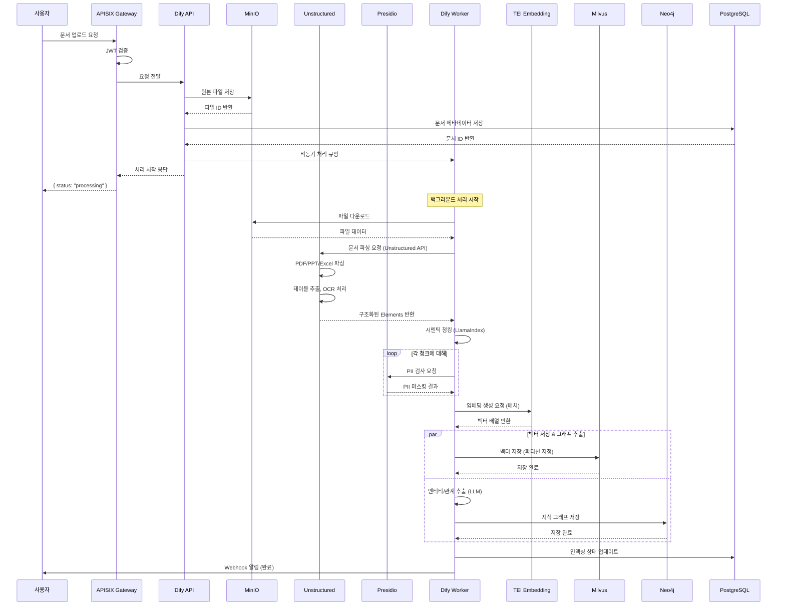
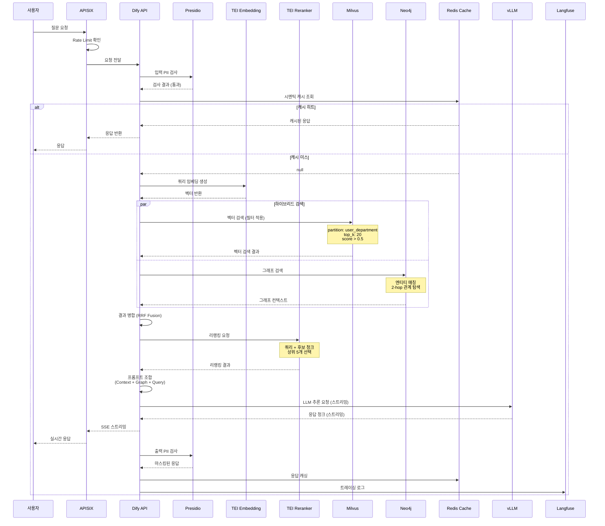
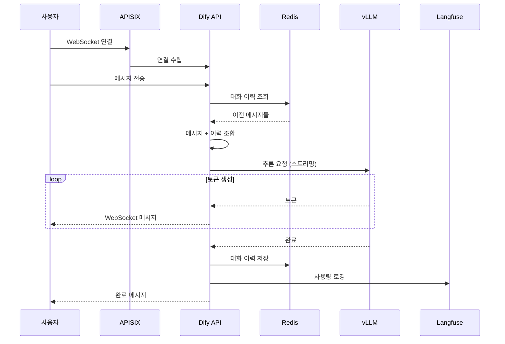
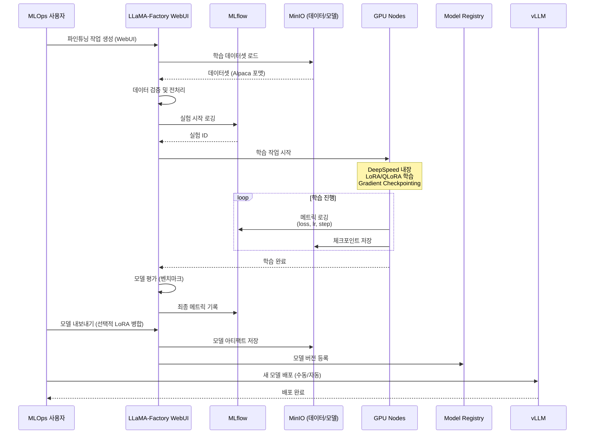
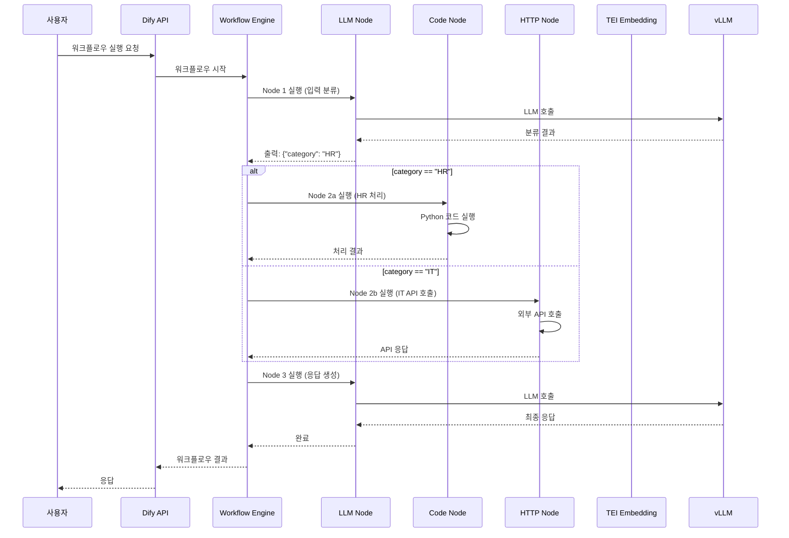

# LLMFlow 데이터 플로우

## 문서 정보

| 항목 | 내용 |
|------|------|
| 문서명 | LLMFlow 데이터 플로우 |
| 버전 | 2.0 (오픈소스 조합 가이드 반영) |
| 작성일 | 2025-12-13 |

---

## 1. 주요 데이터 플로우 개요

### 1.1 핵심 시나리오

| 시나리오 | 설명 | 관련 컴포넌트 |
|----------|------|--------------|
| 문서 업로드/인덱싱 | 문서를 RAG 시스템에 등록 | Unstructured, Dify, Presidio, TEI, Milvus, Neo4j, MinIO |
| RAG 쿼리 (하이브리드) | 문서 기반 질의응답 (벡터 + 그래프) | Dify, TEI, Milvus, Neo4j, vLLM |
| 채팅 | 일반 LLM 대화 | Dify, vLLM, Redis |
| 파인튜닝 | 모델 커스터마이징 | LLaMA-Factory, MLflow |
| 워크플로우 실행 | 복잡한 AI 작업 | Dify, LangGraph, vLLM |

---

## 2. 문서 업로드/인덱싱 플로우

### 2.1 시퀀스 다이어그램



### 2.2 데이터 변환 단계

```
┌─────────────────────────────────────────────────────────────────────────────┐
│                        문서 인덱싱 파이프라인 (v2.0)                          │
├─────────────────────────────────────────────────────────────────────────────┤
│                                                                             │
│  [1] 원본 문서                                                               │
│  ┌─────────────────────────────────────────────────────────────────────┐   │
│  │ 회사정책.pdf (2MB)                                                   │   │
│  │ - 페이지: 50                                                         │   │
│  │ - 테이블: 10                                                         │   │
│  │ - 이미지: 5                                                          │   │
│  └─────────────────────────────────────────────────────────────────────┘   │
│                              │                                              │
│                              ▼                                              │
│  [2] Unstructured 문서 파싱                                                  │
│  ┌─────────────────────────────────────────────────────────────────────┐   │
│  │ POST /general/v0/general                                             │   │
│  │                                                                      │   │
│  │ 파싱 결과 (Elements):                                                 │   │
│  │ ┌──────────────────────────────────────────────────────────────┐    │   │
│  │ │ { "type": "Title", "text": "연차 휴가 규정" }                  │    │   │
│  │ │ { "type": "NarrativeText", "text": "본 규정은..." }           │    │   │
│  │ │ { "type": "Table", "text": "| 근속연수 | 연차일수 |..." }      │    │   │
│  │ │ { "type": "Image", "text": "[OCR 결과]" }                     │    │   │
│  │ └──────────────────────────────────────────────────────────────┘    │   │
│  │                                                                      │   │
│  │ 메타데이터 보존: 페이지번호, 좌표, 요소 타입                         │   │
│  └─────────────────────────────────────────────────────────────────────┘   │
│                              │                                              │
│                              ▼                                              │
│  [3] 시멘틱 청킹 (LlamaIndex)                                                │
│  ┌─────────────────────────────────────────────────────────────────────┐   │
│  │ 청크 수: 120개                                                       │   │
│  │ 평균 청크 크기: 400 토큰                                              │   │
│  │ 오버랩: 50 토큰                                                       │   │
│  │ 청킹 전략: semantic (문장 경계 유지)                                   │   │
│  │                                                                      │   │
│  │ Unstructured Element 타입별 처리:                                     │   │
│  │ • Title → 다음 NarrativeText와 병합                                  │   │
│  │ • Table → 독립 청크로 유지 (구조 보존)                               │   │
│  │ • Image → OCR 텍스트를 청크로 변환                                   │   │
│  └─────────────────────────────────────────────────────────────────────┘   │
│                              │                                              │
│                              ▼                                              │
│  [4] PII 마스킹 (Presidio)                                                   │
│  ┌─────────────────────────────────────────────────────────────────────┐   │
│  │ 탐지된 PII:                                                          │   │
│  │ - 전화번호: 5개 → [PHONE_NUMBER]                                     │   │
│  │ - 이메일: 3개 → [EMAIL]                                              │   │
│  │ - 주민번호: 1개 → [KR_RRN]                                           │   │
│  └─────────────────────────────────────────────────────────────────────┘   │
│                              │                                              │
│                              ▼                                              │
│  [5] 임베딩 생성 (TEI / Infinity)                                            │
│  ┌─────────────────────────────────────────────────────────────────────┐   │
│  │ 서버: TEI (Text Embeddings Inference)                                │   │
│  │ 모델: BAAI/bge-m3 (다국어)                                           │   │
│  │ 차원: 1024                                                           │   │
│  │ 벡터 수: 120개                                                        │   │
│  │                                                                      │   │
│  │ 배치 처리: 32개씩 묶어서 요청 (처리 시간 최적화)                      │   │
│  │ POST /embed { "inputs": [...] }                                      │   │
│  └─────────────────────────────────────────────────────────────────────┘   │
│                              │                                              │
│              ┌───────────────┴───────────────┐                              │
│              ▼                               ▼                              │
│  [6a] 벡터 저장 (Milvus)        [6b] 그래프 저장 (Neo4j)                     │
│  ┌─────────────────────────┐   ┌─────────────────────────┐                 │
│  │ Collection: documents    │   │ 엔티티 추출 (LLM):      │                 │
│  │ Partition: dept_hr       │   │ • "연차휴가" (Policy)   │                 │
│  │ 인덱스: HNSW             │   │ • "그룹웨어" (System)   │                 │
│  │                          │   │ • "인사팀" (Org)        │                 │
│  │ 메타데이터:               │   │                         │                 │
│  │ - document_id            │   │ 관계 추출:              │                 │
│  │ - chunk_id               │   │ (연차휴가)-[:MANAGED_BY]│                 │
│  │ - page_number            │   │  ->(그룹웨어)           │                 │
│  │ - element_type           │   │ (인사팀)-[:OWNS]->      │                 │
│  │ - department             │   │  (연차휴가)             │                 │
│  └─────────────────────────┘   └─────────────────────────┘                 │
│                                                                             │
└─────────────────────────────────────────────────────────────────────────────┘
```

### 2.3 데이터 스키마

#### PostgreSQL - 문서 메타데이터

```sql
CREATE TABLE documents (
    id UUID PRIMARY KEY,
    dataset_id UUID NOT NULL,
    tenant_id UUID NOT NULL,
    name VARCHAR(255) NOT NULL,
    file_path VARCHAR(500),
    mime_type VARCHAR(100),
    size_bytes BIGINT,
    status VARCHAR(50) DEFAULT 'pending',
    chunks_count INTEGER DEFAULT 0,
    entities_count INTEGER DEFAULT 0,  -- GraphRAG 엔티티 수
    created_by UUID,
    created_at TIMESTAMP DEFAULT NOW(),
    updated_at TIMESTAMP,
    metadata JSONB,

    CONSTRAINT fk_dataset FOREIGN KEY (dataset_id) REFERENCES datasets(id)
);

CREATE INDEX idx_documents_tenant ON documents(tenant_id);
CREATE INDEX idx_documents_status ON documents(status);
```

#### Milvus - 벡터 스키마

```python
collection_schema = CollectionSchema(
    fields=[
        FieldSchema(name="id", dtype=DataType.VARCHAR, max_length=64, is_primary=True),
        FieldSchema(name="document_id", dtype=DataType.VARCHAR, max_length=64),
        FieldSchema(name="chunk_id", dtype=DataType.INT64),
        FieldSchema(name="content", dtype=DataType.VARCHAR, max_length=8192),
        FieldSchema(name="embedding", dtype=DataType.FLOAT_VECTOR, dim=1024),
        FieldSchema(name="tenant_id", dtype=DataType.VARCHAR, max_length=64),
        FieldSchema(name="department", dtype=DataType.VARCHAR, max_length=64),
        FieldSchema(name="page_number", dtype=DataType.INT32),
        FieldSchema(name="element_type", dtype=DataType.VARCHAR, max_length=32),  # Title, Table, etc.
        FieldSchema(name="created_at", dtype=DataType.INT64),
    ],
    description="Document chunks collection"
)
```

#### Neo4j - 그래프 스키마

```cypher
// 노드 타입
CREATE CONSTRAINT FOR (d:Document) REQUIRE d.id IS UNIQUE;
CREATE CONSTRAINT FOR (c:Chunk) REQUIRE c.id IS UNIQUE;
CREATE CONSTRAINT FOR (e:Entity) REQUIRE e.name IS UNIQUE;

// 인덱스
CREATE INDEX FOR (d:Document) ON (d.tenant_id);
CREATE INDEX FOR (e:Entity) ON (e.type);
CREATE INDEX FOR (c:Chunk) ON (c.embedding_id);

// 스키마
(:Document {id, name, tenant_id, created_at})
(:Chunk {id, content, embedding_id, page_number, position})
(:Entity {name, type, description, tenant_id})
(:Topic {name, description})

// 관계
(:Document)-[:HAS_CHUNK]->(:Chunk)
(:Chunk)-[:MENTIONS {confidence: float}]->(:Entity)
(:Entity)-[:RELATED_TO {relation_type: string, weight: float}]->(:Entity)
(:Chunk)-[:ABOUT]->(:Topic)
```

---

## 3. RAG 쿼리 플로우 (하이브리드)

### 3.1 시퀀스 다이어그램



### 3.2 하이브리드 검색 파이프라인 상세

```
┌─────────────────────────────────────────────────────────────────────────────┐
│                    RAG 하이브리드 검색 파이프라인 (v2.0)                       │
├─────────────────────────────────────────────────────────────────────────────┤
│                                                                             │
│  [입력] "연차 휴가 신청 방법이 뭐야?"                                         │
│                              │                                              │
│                              ▼                                              │
│  [1] 쿼리 전처리                                                             │
│  ┌─────────────────────────────────────────────────────────────────────┐   │
│  │ • PII 검사: 통과                                                     │   │
│  │ • 쿼리 정규화: 불용어 제거, 형태소 분석                                │   │
│  │ • 엔티티 추출: ["연차", "휴가", "신청"]                                │   │
│  └─────────────────────────────────────────────────────────────────────┘   │
│                              │                                              │
│                              ▼                                              │
│  [2] 쿼리 임베딩 (TEI)                                                       │
│  ┌─────────────────────────────────────────────────────────────────────┐   │
│  │ • 서버: TEI Embedding Server                                         │   │
│  │ • 모델: BAAI/bge-m3                                                  │   │
│  │ • 벡터: [0.023, -0.015, ..., 0.042] (1024차원)                       │   │
│  │ • 처리 시간: 25ms                                                    │   │
│  └─────────────────────────────────────────────────────────────────────┘   │
│                              │                                              │
│              ┌───────────────┴───────────────┐                              │
│              ▼                               ▼                              │
│  [3a] 벡터 검색 (Milvus)        [3b] 그래프 검색 (Neo4j)                     │
│  ┌─────────────────────────┐   ┌─────────────────────────────────────┐     │
│  │ • 메트릭: COSINE         │   │ MATCH (e:Entity)                    │     │
│  │ • 파티션: ["hr","shared"]│   │ WHERE e.name IN ["연차","휴가"]      │     │
│  │ • top_k: 20              │   │ MATCH (e)<-[:MENTIONS]-(c:Chunk)    │     │
│  │ • 결과: 20개 후보        │   │ MATCH (e)-[:RELATED_TO*1..2]-(r)    │     │
│  │                          │   │ RETURN c, r                         │     │
│  │ 처리 시간: 15ms          │   │                                     │     │
│  │                          │   │ 결과: 10개 관련 청크 + 엔티티 컨텍스트│     │
│  │                          │   │ 처리 시간: 30ms                     │     │
│  └─────────────────────────┘   └─────────────────────────────────────┘     │
│              │                               │                              │
│              └───────────────┬───────────────┘                              │
│                              ▼                                              │
│  [4] 결과 병합 (RRF - Reciprocal Rank Fusion)                                │
│  ┌─────────────────────────────────────────────────────────────────────┐   │
│  │ RRF Score = Σ 1/(k + rank_i)                                        │   │
│  │                                                                      │   │
│  │ 벡터 검색 결과:      그래프 검색 결과:     최종 병합:                  │   │
│  │ 1. chunk_A (0.95)    1. chunk_C            1. chunk_A (RRF: 0.08)    │   │
│  │ 2. chunk_B (0.90)    2. chunk_A            2. chunk_C (RRF: 0.07)    │   │
│  │ 3. chunk_C (0.85)    3. chunk_D            3. chunk_B (RRF: 0.05)    │   │
│  │ ...                  ...                   ...                       │   │
│  │                                                                      │   │
│  │ 병합 후 후보: 25개                                                    │   │
│  └─────────────────────────────────────────────────────────────────────┘   │
│                              │                                              │
│                              ▼                                              │
│  [5] 리랭킹 (TEI Reranker)                                                   │
│  ┌─────────────────────────────────────────────────────────────────────┐   │
│  │ • 서버: TEI Reranking Server                                         │   │
│  │ • 모델: BAAI/bge-reranker-v2-m3                                      │   │
│  │ • 입력: 쿼리 + 25개 후보                                              │   │
│  │ • 출력: 점수 재계산 후 상위 5개 선택                                   │   │
│  │ • 처리 시간: 40ms                                                    │   │
│  │                                                                      │   │
│  │ POST /rerank                                                         │   │
│  │ { "query": "연차 휴가 신청 방법", "texts": [...] }                    │   │
│  └─────────────────────────────────────────────────────────────────────┘   │
│                              │                                              │
│                              ▼                                              │
│  [6] 컨텍스트 조합 (벡터 + 그래프)                                           │
│  ┌─────────────────────────────────────────────────────────────────────┐   │
│  │ 검색된 문서 컨텍스트:                                                  │   │
│  │ [1] 연차관리규정.pdf (p.3): "연차 휴가 신청은 그룹웨어..."            │   │
│  │ [2] 연차관리규정.pdf (p.4): "신청 기한은 사용 3일 전..."              │   │
│  │ [3] 인사FAQ.pdf (p.12): "연차 휴가 승인권자는..."                     │   │
│  │                                                                      │   │
│  │ 그래프 컨텍스트:                                                      │   │
│  │ • "연차휴가"는 "그룹웨어"를 통해 관리됨                               │   │
│  │ • "연차휴가"는 "인사팀"이 소유                                        │   │
│  │ • 관련 정책: "휴가규정", "근태관리"                                   │   │
│  │                                                                      │   │
│  │ 총 컨텍스트 토큰: 1,500                                               │   │
│  └─────────────────────────────────────────────────────────────────────┘   │
│                              │                                              │
│                              ▼                                              │
│  [7] LLM 프롬프트 생성                                                       │
│  ┌─────────────────────────────────────────────────────────────────────┐   │
│  │ System: 당신은 회사 정책 안내 도우미입니다.                            │   │
│  │         아래 컨텍스트와 지식 그래프 정보를 기반으로 답변하세요.        │   │
│  │                                                                      │   │
│  │ Knowledge Graph:                                                     │   │
│  │ - 연차휴가 → MANAGED_BY → 그룹웨어                                   │   │
│  │ - 연차휴가 → OWNED_BY → 인사팀                                       │   │
│  │                                                                      │   │
│  │ Document Context: {검색된 문서 컨텍스트}                              │   │
│  │                                                                      │   │
│  │ User: 연차 휴가 신청 방법이 뭐야?                                     │   │
│  └─────────────────────────────────────────────────────────────────────┘   │
│                              │                                              │
│                              ▼                                              │
│  [출력] "연차 휴가 신청은 그룹웨어 시스템에서 진행하며..."                   │
│                                                                             │
│  [성능 요약]                                                                 │
│  • 총 처리 시간: ~150ms (임베딩 25ms + 검색 45ms + 리랭킹 40ms + LLM)       │
│  • 그래프 검색으로 관계 기반 컨텍스트 풍부화                                 │
│                                                                             │
└─────────────────────────────────────────────────────────────────────────────┘
```

---

## 4. 채팅 플로우

### 4.1 시퀀스 다이어그램



### 4.2 대화 컨텍스트 관리

```
┌─────────────────────────────────────────────────────────────────────────────┐
│                       대화 컨텍스트 관리                                      │
├─────────────────────────────────────────────────────────────────────────────┤
│                                                                             │
│  Redis 키 구조:                                                              │
│  ┌─────────────────────────────────────────────────────────────────────┐   │
│  │ chat:session:{session_id}:messages                                   │   │
│  │   - List 타입                                                        │   │
│  │   - TTL: 24시간                                                      │   │
│  │   - 최대 메시지: 100개                                                │   │
│  └─────────────────────────────────────────────────────────────────────┘   │
│                                                                             │
│  메시지 형식:                                                                 │
│  {                                                                          │
│    "id": "msg_xxx",                                                         │
│    "role": "user" | "assistant",                                            │
│    "content": "...",                                                        │
│    "timestamp": 1702000000,                                                 │
│    "tokens": 50                                                             │
│  }                                                                          │
│                                                                             │
│  컨텍스트 윈도우 관리:                                                        │
│  ┌─────────────────────────────────────────────────────────────────────┐   │
│  │ • 모델 컨텍스트 한도: 32,768 토큰                                    │   │
│  │ • 시스템 프롬프트: 500 토큰 예약                                      │   │
│  │ • 응답 공간: 4,000 토큰 예약                                          │   │
│  │ • 대화 이력: 28,268 토큰 사용 가능                                    │   │
│  │                                                                      │   │
│  │ 윈도우 초과 시:                                                       │   │
│  │ 1. 오래된 메시지부터 요약                                             │   │
│  │ 2. 요약 결과를 시스템 프롬프트에 포함                                  │   │
│  │ 3. 최근 N개 메시지만 유지                                             │   │
│  └─────────────────────────────────────────────────────────────────────┘   │
│                                                                             │
└─────────────────────────────────────────────────────────────────────────────┘
```

---

## 5. 파인튜닝 플로우 (LLaMA-Factory)

### 5.1 시퀀스 다이어그램



### 5.2 학습 데이터 플로우 (LLaMA-Factory)

```
┌─────────────────────────────────────────────────────────────────────────────┐
│                 파인튜닝 데이터 플로우 (LLaMA-Factory v2.0)                    │
├─────────────────────────────────────────────────────────────────────────────┤
│                                                                             │
│  [1] 데이터 준비 (dataset_info.json)                                        │
│  ┌─────────────────────────────────────────────────────────────────────┐   │
│  │ 지원 형식:                                                           │   │
│  │ • Alpaca: {"instruction", "input", "output"}                        │   │
│  │ • ShareGPT: {"conversations": [...]}                                │   │
│  │ • 커스텀 템플릿                                                      │   │
│  │                                                                      │   │
│  │ 데이터셋 설정:                                                        │   │
│  │ {                                                                    │   │
│  │   "company_qa": {                                                    │   │
│  │     "file_name": "company_qa.json",                                 │   │
│  │     "columns": {                                                    │   │
│  │       "prompt": "instruction",                                       │   │
│  │       "response": "output"                                          │   │
│  │     }                                                                │   │
│  │   }                                                                  │   │
│  │ }                                                                    │   │
│  │                                                                      │   │
│  │ 저장 위치: MinIO s3://datasets/finetune/                            │   │
│  └─────────────────────────────────────────────────────────────────────┘   │
│                              │                                              │
│                              ▼                                              │
│  [2] LLaMA-Factory WebUI 설정                                               │
│  ┌─────────────────────────────────────────────────────────────────────┐   │
│  │ ┌──────────────────────────────────────────────────────────────┐    │   │
│  │ │ Model Selection:        │ Training Method:                   │    │   │
│  │ │ ○ Llama-3.1-8B          │ ○ Full Finetuning                  │    │   │
│  │ │ ● Llama-3.1-70B         │ ● LoRA (Recommended)               │    │   │
│  │ │ ○ Qwen-2.5-72B          │ ○ QLoRA (4-bit)                    │    │   │
│  │ │ ○ Custom Model          │ ○ DoRA                             │    │   │
│  │ └──────────────────────────────────────────────────────────────┘    │   │
│  │                                                                      │   │
│  │ LoRA 설정:                                                           │   │
│  │ • Rank: 64                                                           │   │
│  │ • Alpha: 128                                                         │   │
│  │ • Target Modules: q_proj, v_proj, k_proj, o_proj                    │   │
│  │ • Dropout: 0.1                                                       │   │
│  │                                                                      │   │
│  │ 학습 설정:                                                            │   │
│  │ • Batch Size: 4                                                      │   │
│  │ • Gradient Accumulation: 8 (Effective: 32)                          │   │
│  │ • Learning Rate: 2e-4                                               │   │
│  │ • Epochs: 3                                                          │   │
│  │ • Scheduler: Cosine                                                 │   │
│  └─────────────────────────────────────────────────────────────────────┘   │
│                              │                                              │
│                              ▼                                              │
│  [3] 분산 학습 (DeepSpeed 내장)                                              │
│  ┌─────────────────────────────────────────────────────────────────────┐   │
│  │ LLaMA-Factory 내장 DeepSpeed 설정:                                   │   │
│  │                                                                      │   │
│  │ deepspeed:                                                           │   │
│  │   stage: 2  # ZeRO Stage 2                                          │   │
│  │   offload_optimizer: false                                          │   │
│  │   offload_param: false                                              │   │
│  │                                                                      │   │
│  │ Flash Attention 2: Enabled                                          │   │
│  │ Gradient Checkpointing: Enabled                                     │   │
│  │                                                                      │   │
│  │ GPU 할당:                                                             │   │
│  │ • 8B 모델: 1x A100 80GB                                              │   │
│  │ • 70B 모델: 4x A100 80GB (LoRA)                                     │   │
│  │ • 70B 모델: 8x H100 80GB (Full)                                     │   │
│  └─────────────────────────────────────────────────────────────────────┘   │
│                              │                                              │
│                              ▼                                              │
│  [4] MLflow 실험 추적                                                        │
│  ┌─────────────────────────────────────────────────────────────────────┐   │
│  │ 자동 로깅 항목:                                                       │   │
│  │ • 하이퍼파라미터 (rank, lr, batch_size, ...)                         │   │
│  │ • 학습 메트릭 (loss, grad_norm, lr)                                  │   │
│  │ • 평가 메트릭 (eval_loss, perplexity)                                │   │
│  │ • GPU 사용량                                                         │   │
│  │                                                                      │   │
│  │ MLflow URI: http://mlflow.llmflow-mlops:5000                        │   │
│  │ Experiment: llama-factory-experiments                               │   │
│  └─────────────────────────────────────────────────────────────────────┘   │
│                              │                                              │
│                              ▼                                              │
│  [5] 모델 평가 & 내보내기                                                    │
│  ┌─────────────────────────────────────────────────────────────────────┐   │
│  │ 평가 (Evaluate 탭):                                                   │   │
│  │ • 내장 벤치마크 (MMLU, HellaSwag, C-Eval)                           │   │
│  │ • 커스텀 테스트셋 평가                                               │   │
│  │                                                                      │   │
│  │ 내보내기 (Export 탭):                                                 │   │
│  │ • LoRA 어댑터만 저장 (경량)                                          │   │
│  │ • LoRA + Base 병합 (배포용)                                          │   │
│  │ • GGUF 변환 (로컬 추론용)                                             │   │
│  │                                                                      │   │
│  │ 저장 위치:                                                            │   │
│  │ • MinIO: s3://models/finetuned/{model_name}/{version}/              │   │
│  │ • MLflow Registry: models:/llama-3.1-70b-company/1                  │   │
│  └─────────────────────────────────────────────────────────────────────┘   │
│                              │                                              │
│                              ▼                                              │
│  [6] vLLM 배포                                                               │
│  ┌─────────────────────────────────────────────────────────────────────┐   │
│  │ 배포 옵션:                                                            │   │
│  │                                                                      │   │
│  │ A. LoRA 어댑터 동적 로딩 (권장):                                      │   │
│  │    vllm serve --model base-model \                                  │   │
│  │         --enable-lora \                                             │   │
│  │         --lora-modules company-lora=/path/to/adapter                │   │
│  │                                                                      │   │
│  │ B. 병합 모델 배포:                                                    │   │
│  │    vllm serve --model /path/to/merged-model                         │   │
│  │                                                                      │   │
│  │ 무중단 배포: Kubernetes Rolling Update                               │   │
│  └─────────────────────────────────────────────────────────────────────┘   │
│                                                                             │
└─────────────────────────────────────────────────────────────────────────────┘
```

---

## 6. 워크플로우 실행 플로우

### 6.1 Dify 워크플로우 실행



### 6.2 LangGraph 멀티에이전트 플로우

```
┌─────────────────────────────────────────────────────────────────────────────┐
│                       LangGraph 멀티에이전트 플로우                           │
├─────────────────────────────────────────────────────────────────────────────┤
│                                                                             │
│  [사용자 요청] "2024년 분기별 매출 분석 보고서 작성해줘"                       │
│                              │                                              │
│                              ▼                                              │
│  ┌─────────────────────────────────────────────────────────────────────┐   │
│  │                    Supervisor Agent                                  │   │
│  │                                                                      │   │
│  │  역할: 작업 분배 및 조정                                              │   │
│  │  상태:                                                                │   │
│  │    - task: "매출 분석 보고서"                                         │   │
│  │    - agents: [researcher, analyst, writer]                           │   │
│  │    - current_step: 0                                                 │   │
│  └─────────────────────────────────────────────────────────────────────┘   │
│                              │                                              │
│              ┌───────────────┼───────────────┐                              │
│              │               │               │                              │
│              ▼               ▼               ▼                              │
│  ┌───────────────┐ ┌───────────────┐ ┌───────────────┐                     │
│  │   Researcher  │ │    Analyst    │ │    Writer     │                     │
│  │   Agent       │ │    Agent      │ │    Agent      │                     │
│  │               │ │               │ │               │                     │
│  │ • ERP 데이터  │ │ • 통계 분석  │ │ • 보고서 작성 │                     │
│  │   조회        │ │ • 트렌드 파악│ │ • 포맷팅     │                     │
│  │ • 외부 데이터 │ │ • 인사이트   │ │ • 차트 생성  │                     │
│  │   수집        │ │   도출       │ │               │                     │
│  └───────────────┘ └───────────────┘ └───────────────┘                     │
│         │                  │                  │                             │
│         ▼                  ▼                  ▼                             │
│  ┌─────────────────────────────────────────────────────────────────────┐   │
│  │                         State Graph                                  │   │
│  │                                                                      │   │
│  │  상태 전이:                                                           │   │
│  │  start → researcher → analyst → writer → end                         │   │
│  │       (데이터 수집)  (분석)    (작성)                                  │   │
│  │                                                                      │   │
│  │  Human-in-the-Loop:                                                  │   │
│  │  • analyst → [human_review] → writer                                 │   │
│  │  • 분석 결과 검토 후 승인 시 진행                                     │   │
│  │                                                                      │   │
│  │  Checkpoint (Redis/PostgreSQL):                                      │   │
│  │  • 각 단계 완료 시 상태 저장                                          │   │
│  │  • 실패 시 마지막 체크포인트에서 재개                                  │   │
│  └─────────────────────────────────────────────────────────────────────┘   │
│                              │                                              │
│                              ▼                                              │
│  [최종 출력] "2024년 분기별 매출 분석 보고서.pdf"                            │
│                                                                             │
└─────────────────────────────────────────────────────────────────────────────┘
```

---

## 7. 감사 로그 플로우

### 7.1 로그 수집 파이프라인

```
┌─────────────────────────────────────────────────────────────────────────────┐
│                         감사 로그 파이프라인                                  │
├─────────────────────────────────────────────────────────────────────────────┤
│                                                                             │
│  ┌─────────────────────────────────────────────────────────────────────┐   │
│  │                       Log Sources                                    │   │
│  │                                                                      │   │
│  │  ┌──────────┐ ┌──────────┐ ┌──────────┐ ┌──────────┐ ┌──────────┐  │   │
│  │  │ APISIX   │ │  Dify    │ │  vLLM    │ │   TEI    │ │ Keycloak │  │   │
│  │  │ (API)    │ │  (앱)    │ │ (추론)   │ │(임베딩)  │ │  (인증)  │  │   │
│  │  └────┬─────┘ └────┬─────┘ └────┬─────┘ └────┬─────┘ └────┬─────┘  │   │
│  │       │            │            │            │            │         │   │
│  │  ┌──────────┐ ┌──────────┐                                          │   │
│  │  │  Neo4j   │ │Unstructured│                                        │   │
│  │  │ (그래프) │ │  (ETL)   │                                          │   │
│  │  └────┬─────┘ └────┬─────┘                                          │   │
│  │       │            │                                                 │   │
│  └───────┼────────────┼─────────────────────────────────────────────────┘   │
│          │            │                                                     │
│          └────────────┴─────────────────┬───────────────────────────────┘   │
│                                         │                                   │
│                                         ▼                                   │
│  ┌─────────────────────────────────────────────────────────────────────┐   │
│  │                     Fluent Bit (수집)                                │   │
│  │                                                                      │   │
│  │  • JSON 파싱                                                         │   │
│  │  • 필드 추가 (tenant_id, trace_id)                                   │   │
│  │  • PII 필터링                                                        │   │
│  │  • 버퍼링                                                            │   │
│  └─────────────────────────────────────────────────────────────────────┘   │
│                             │                                              │
│                             ▼                                              │
│  ┌─────────────────────────────────────────────────────────────────────┐   │
│  │                     OpenSearch (저장)                                │   │
│  │                                                                      │   │
│  │  인덱스 패턴:                                                         │   │
│  │  • llmflow-audit-{YYYY.MM.DD}                                       │   │
│  │  • llmflow-api-{YYYY.MM.DD}                                         │   │
│  │  • llmflow-inference-{YYYY.MM.DD}                                   │   │
│  │  • llmflow-embedding-{YYYY.MM.DD}                                   │   │
│  │  • llmflow-etl-{YYYY.MM.DD}                                         │   │
│  │                                                                      │   │
│  │  보존 정책:                                                           │   │
│  │  • Hot: 7일                                                          │   │
│  │  • Warm: 30일                                                        │   │
│  │  • Cold: 365일                                                       │   │
│  └─────────────────────────────────────────────────────────────────────┘   │
│                             │                                              │
│                             ▼                                              │
│  ┌─────────────────────────────────────────────────────────────────────┐   │
│  │                     Grafana (시각화)                                  │   │
│  │                                                                      │   │
│  │  대시보드:                                                            │   │
│  │  • 사용량 현황                                                        │   │
│  │  • 임베딩/리랭킹 성능                                                 │   │
│  │  • 문서 파싱 현황 (Unstructured)                                     │   │
│  │  • GraphRAG 쿼리 분석                                                │   │
│  │  • 에러 분석                                                          │   │
│  │  • 보안 이벤트                                                        │   │
│  └─────────────────────────────────────────────────────────────────────┘   │
│                                                                             │
└─────────────────────────────────────────────────────────────────────────────┘
```

---

## 변경 이력

| 버전 | 날짜 | 변경 내용 | 작성자 |
|------|------|----------|--------|
| 1.0 | 2025-12-13 | 초기 작성 | LLMFlow Team |
| 2.0 | 2025-12-13 | 오픈소스 조합 가이드 v2.0 반영 - Unstructured ETL 추가, TEI/Infinity 임베딩/리랭킹 추가, Neo4j GraphRAG 추가, LLaMA-Factory 파인튜닝 플로우 변경 | LLMFlow Team |
